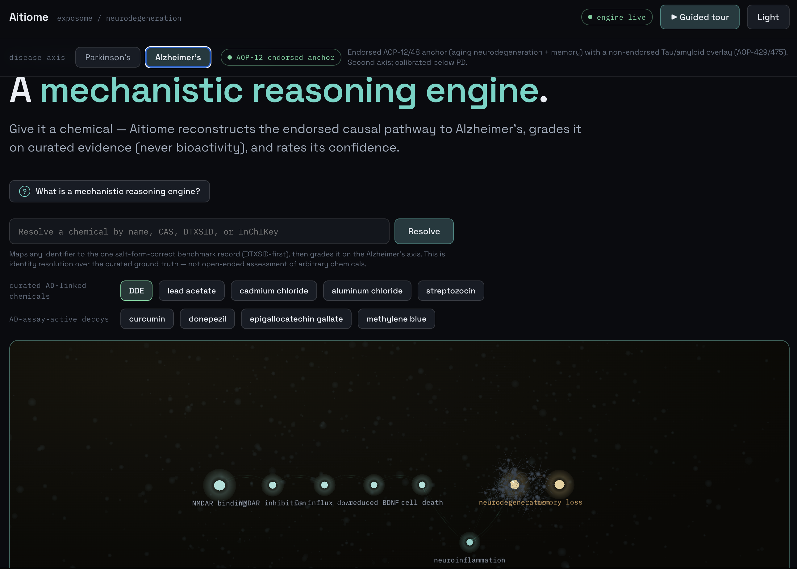

# Aitiome

**An honest mechanistic-reasoning engine for the environmental exposome of neurodegeneration.**

`Go` · `React 18 + TypeScript + Vite` · `Three.js / GLSL` · `MCP` · `Claude Opus 4.8` · `MIT` · *Built with Claude: Life Sciences*



> Submitted by **Jon Radoff** for the **Built with Claude: Life Sciences** hackathon (judged with the Gladstone Institutes).

Give Aitiome a chemical and it reconstructs the OECD-endorsed causal pathway — molecular initiating
event (MIE) → key events (KE) → adverse outcome (AO) — to a Parkinson's or Alzheimer's hallmark, grades it
on **curated evidence (never bioactivity)**, and rates its confidence. It proves itself two ways at once: it
**recovers** the known neurotoxicants on the endorsed scaffold, and it **refuses to be fooled** by bioactive
compounds that are not neurotoxic.

It is **not** a system that claims to discover novel neurodegeneration-causing chemicals. It is transparent
about exactly where AI-driven discovery is, and is not, possible on this chemical class — and it ships that
honesty as a feature.

---

## ▶ Try it live

- **App → https://aitiome.fly.dev**
- **Presentation deck → https://aitiome.fly.dev/presentation.pdf**

Click a **known neurotoxicant** to watch the endorsed cascade reconstruct and ignite the vulnerable
dopaminergic-neuron terminal. Click a **bioactive decoy** to see it withheld and rejected on independent
lines of evidence.

---

### A methods result: how should Claude synthesize scientific evidence?

Alongside the engine, we studied *how* Claude should assemble scientific evidence — comparing four methods
(**RAG**, **RAG+**, **RLM**, **RLM-ADV**) on one shared, deterministic scorer across six chemicals.

> **Adversarial RLM (RLM-ADV) surfaced ~10× more counter-evidence than RAG and ~2.2× more than the strong
> RAG+ baseline** — while matching RAG+ on yield and source breadth, running under a degraded web-search
> backend. Surfacing *disconfirming* evidence is precisely the property a calibrated-honesty tool needs most.

**Conclusion: adversarial RLM is the right synthesis method for this life-science evidence-assembly use case.**
See the [live RLM page](https://aitiome.fly.dev/rlm) and [`docs/research/rlm/FINDINGS.md`](docs/research/rlm/FINDINGS.md).

---

## What we presented

The full narrative, live product tour, and figures are in the
[hosted deck](https://aitiome.fly.dev/presentation.pdf). The essentials:

**The problem.** The large majority of Parkinson's (PD) and Alzheimer's (AD) is *sporadic*, not inherited. A
major, understudied contributor is the **environmental exposome** — the pesticides, metals, and industrial
chemicals we meet over a lifetime. In 2024 the field's leaders (Miller, Barouki, Samieri; *Nature Neuroscience*)
called for AI that connects chemicals to disease *mechanism*.

**Why it's hard.** Tens of thousands of chemicals are **bioactive** — they light up assays. Very few have
curated evidence for human neurodegeneration. The entire difficulty is telling a true neurotoxicant apart from
a compound that is merely bioactive. That is the exact failure mode of activity-based screening, and Aitiome is
built to win that one discrimination.

**The recovery rule (the core discipline).**

```
positive  <=>  ( CTD curated Parkinson's DirectEvidence )  OR  ( registered neuro-AOP stressor )
```

Curated signals are **diagnostic**. Assay/bioactivity activity is **corroboration only and anti-diagnostic**:
it illustrates mechanism for known positives but cannot discriminate, so the engine **never gates a positive
call on it**.

**The validation result** (on the reconnaissance ground truth):

| axis | recovered | negatives rejected | adversarial decoys rejected | false positives | false negatives |
|---|---|---|---|---|---|
| **Parkinson's** | **13 / 13** | 15 / 15 | **6 / 6** | **0** | **0** |
| **Alzheimer's** | **12 / 12** | ✓ | ✓ | **0** | **0** |

The 6 adversarial decoys are mitochondria-active, non-neurotoxic compounds designed to fool an activity model
(troglitazone, prochloraz, propiconazole, simvastatin, fenofibrate, warfarin). **Recovery is the sanity check;
the 6/6 decoy rejection is the contribution** — always read the two together.

**The falsification.** Computed live from our own data: the AUROC of every bioactivity signal separating the
positives from the adversarial decoys is **at or below chance (0.5)** — mitochondrial assays 0.16, membrane
potential 0.12, oxidative stress 0.20, mechanistic assays 0.39, ToxCast-active 0.15. The decoys are, if
anything, *more* bioactive than the real neurotoxicants. Bioactivity is anti-diagnostic here; the curated rule
is perfect on the same set.

**The honest discovery map.** We tested seven independent discovery axes (transcriptomics, morphology,
structure/QSAR, full bioactivity fingerprints, knowledge graphs, physics-based docking). Every one was
*coverage-killed* (environmental toxicants aren't profiled in drug-centric databases) or *confounder-killed*
(general bioactivity is not neurotoxicity). That reproducible negative result is shipped as a first-class map,
never disguised as a predictor.

**The candidate triage queue.** The honest form of the original discovery goal: an evidence-weighted priority
queue of chemicals with real-but-incomplete evidence, each with its evidence strands, distance-to-gate, and a
recommended next experiment for a wet lab. The ranking never decides — **only the curated gate promotes**. The
six decoys are carried as a permanent control and rank last; a held-out backtest recovers a known positive
(TCE/DDE) from non-curated strands alone, above every decoy: prioritization skill, not causal discovery.

**Two disease axes.** The identical curated-diagnostic engine runs on both **PD** (endorsed AOP-3 anchor) and
**AD** (endorsed AOP-12/48 anchor + a non-endorsed Tau/amyloid overlay). Honesty is by calibration, not less
rigor: AD's weaker spots are surfaced in the UI compare matrix.

---

## Technical architecture & features

The whole app ships as **one ~13 MB Go binary** that serves the web UI, the `/api/*` HTTP API, and — as a
sibling adapter — an **MCP server**. The design is a **transport-agnostic service layer** (all domain logic in
one Go package, `services/aitio`) with **thin HTTP and MCP adapters** over the identical service methods. A
scientist and an external agent drive the same engine — the dual human + agent interface is a core pillar.

```
                 +------------------------------------------------------+
                 |  contract/  (the seam: types + fixtures, versioned)  |
                 |  goapi (Go) . ts (TypeScript) . fixtures/ . VERSION  |
                 +------------------------------------------------------+
                       ^                                        ^
        imports        |                                        |  imports (types + fixtures)
   +-------------------------------------+          +-------------------------------------+
   |  services/  (Go)                    |          |  web/  (React + TS + Three.js)      |
   |  aitio (one service package)        |   /api   |  hero/  GLSL cascade + neuron       |
   |   resolver . aop . recovery         | <------- |  components/  evidence, trace,      |
   |   evidence . validation . reasoner  |  proxy   |    validation, discovery, MCP, ...  |
   |  cmd/httpd (HTTP)  cmd/mcpd (MCP)    |          |  data layer (live first, fixtures)  |
   +-------------------------------------+          +-------------------------------------+
```

- **Deterministic core, no LLM in the decision path.** The pipeline is a fixed sequence — resolve → curated
  gate → reconstruct the endorsed AOP → converge evidence → rank candidates → falsify against the decoys. It is
  deterministic over curated data: same input, same output, auditable, reproducible.
- **Claude Opus 4.8 evidence-reasoner.** An `EvidenceReasoner` writes a calibrated, `[E#]`-cited prose
  synthesis of each completed assessment. It is hard-bounded to **explain, never decide**: it cannot change the
  call or the tier. A deterministic direct reasoner is the always-available fallback, so the endpoint works
  without an API key. Model is configurable per role.
- **Core ⟂ visualization split** behind a **versioned `contract/`** (typed Go + TypeScript schema + fixtures).
  The visualization runs entirely on contract fixtures; integration is a fixture-to-live flip.
- **React 18 + TypeScript + Vite frontend** with a **Three.js / GLSL hero visualization**: an exposome particle
  field, evidence-weighted glowing cascade edges, the SOX6/AGTR1 dopaminergic-neuron terminal igniting for
  positives, rejection rings for decoys. Dark mode by default, light-mode parity.
- **`go:embed` curated data**, deterministic at load: CTD `DirectEvidence`, AOP-Wiki, MitoCarta3.0, Kamath
  2022, ToxCast / NICEATM ICE (corroboration only), openFDA FAERS, and B3DB for brain exposure.
- **Correctness spine:** DTXSID-first, salt-form-correct identity resolution — not PubChem-synonym guessing
  (the paraquat-dichloride trap, test-locked).

**MCP — the agentic interface.** The built-in MCP server exposes the same engine as **13 tools** an external
agent can drive, getting the same graded, cited call a scientist does. Full reference: [`mcp.md`](mcp.md) and
the [live MCP page](https://aitiome.fly.dev/mcp). The Claude Science curation workflow (`make curate` /
`assess_curated`) is documented in [`docs/claude-science.md`](docs/claude-science.md).

---

## MCP working examples

Representative tool calls and their (illustrative) results. The engine is deterministic, so a given input
yields a stable result; the JSON below is trimmed for readability.

### `assess_compound` — resolve → curated gate → reconstructed AOP → confidence

```jsonc
// tool: assess_compound  { "id": "rotenone", "disease": "pd" }
{
  "compound": { "name": "Rotenone", "dtxsid": "DTXSID6021248", "cas": "83-79-4" },
  "call": "positive",
  "diagnostic": true,
  "gatedOnAssay": false,                         // <- bioactivity NEVER gates the call
  "confidenceTier": "assay_mechanism_recovered",
  "gate": { "ctdDirectEvidence": true, "aopStressorOf": ["AOP-3"] },
  "pathway": {                                    // the endorsed cascade, reconstructed
    "aop": "3",
    "chain": ["MIE 888", "KE 887", "KE 177", "KE 890", "AO 896"]
  },
  "bioactivity": { "role": "corroboration_only" } // illustrates mechanism; not diagnostic
}
```

### `list_candidates` — the evidence-weighted triage queue

```jsonc
// tool: list_candidates  { "disease": "pd" }
{
  "queue": [
    { "name": "Fenpyroximate", "score": 8, "distanceToGate": "gate-ready AOP-3 stressor",
      "nextExperiment": "confirm registered stressor status / CTD DirectEvidence" }
    // ... ranked, non-bioactivity strands only ...
  ],
  "decoyControl": [
    { "name": "Propiconazole", "score": 0, "note": "adversarial decoy — MUST rank last" }
  ],
  "backtest": { "recovered": "TCE / DDE", "fromCuratedStrands": false, "aboveAllDecoys": true }
}
```

The queue is a triage layer, **not a predictor** — only the curated gate promotes; decoys are a permanent
control that must rank last; the held-out backtest recovers a known positive from non-curated strands alone.

### `benchmark` — the falsification harness

```jsonc
// tool: benchmark  {}
{
  "curatedRule": { "falsePositives": 0, "falseNegatives": 0 },   // perfect on the same set
  "bioactivityAUROCvsDecoys": {
    "mitochondrial": 0.16, "membranePotential": 0.12,
    "oxidativeStress": 0.20, "mechanisticTotal": 0.39, "toxCastActive": 0.15
  },
  "verdict": "every bioactivity signal at or below chance (0.5); bioactivity is anti-diagnostic"
}
```

The empirical answer to "you're just detecting bioactivity": the curated rule separates perfectly while every
activity signal is at or below chance against the decoys.

**All 13 MCP tools:** `health` · `list_compounds` · `diseases` · `resolve_compound` · `assess_compound` ·
`run_validation` · `list_candidates` · `synthesize_assessment` · `assess_curated` · `sources` · `benchmark` ·
`discovery_map` · `get_pathway`.

---

## Installation, build & run

**Prerequisites:** Go 1.26+ and Node 22+. For the optional Claude synthesis, copy `.env.example` to `.env` and
set `ANTHROPIC_API_KEY` (default reasoner model `claude-opus-4-8`, configurable via `AITIO_MODEL_REASONER`).
Everything else works without a key.

### Dev workflow

```sh
./run.sh                     # builds + starts the engine (:8787) and the web app
# open http://localhost:5273
```

`run.sh` builds the Go engine, starts the HTTP API on `:8787`, and launches the Vite dev server on `:5273`
(the web app proxies `/api` to the engine and falls back to fixtures). To run pieces individually:

```sh
make run-http                # HTTP API on :8787
make run-mcp                 # MCP server over stdio
cd web && npm install && npm run dev   # frontend dev server on :5273
```

### Production build (single binary: API + web UI)

The engine also serves the built web UI, so the whole app ships as one binary / one container.

```sh
cd web && npm run build && cd ..
go build -o bin/httpd ./services/cmd/httpd
AITIO_WEB_DIR=web/dist ./bin/httpd            # serves API + UI on :8787
```

### Docker

```sh
docker build -t aitiome .
docker run -p 8787:8787 -e ANTHROPIC_API_KEY=sk-ant-... aitiome
```

Without the key the Claude evidence-reasoner falls back to the deterministic one; everything else is identical.

### Deploy (fly.io)

Production runs on fly.io. See [`docs/deploy.md`](docs/deploy.md) for the full launch + secret + custom-domain
steps.

```sh
fly launch --no-deploy --copy-config --name aitiome
fly secrets set ANTHROPIC_API_KEY=sk-ant-...      # never commit the key
fly deploy
```

### Make targets

```sh
make test        # Go tests (harness fp=fn=0, salt-form guard, decoy rejection, synthesis)
make validate    # judge-facing red-team report (bioactivity AUROC vs decoys, invariants)
make fixtures    # regenerate contract/fixtures from the live engine
make curate NAME=ziram   # Claude + web-search curation agent -> engine grade (a hypothesis until verified)
```

### HTTP endpoints

`/health` `/compounds` `/diseases` `/resolve?id=` `/assess?id=[&disease=]` `/synthesis?id=` `/validation`
`/benchmark` `/sources` `/pathway[?aop=3]` `/discovery-map` `/candidates` `POST /assess-curated`

---

## Project layout

```
contract/     the versioned core<->viz seam: goapi (Go), ts (TypeScript), fixtures/, VERSION
services/     Go: aitio service package + cmd/httpd (HTTP) + cmd/mcpd (MCP) adapters
web/          React + TypeScript + Three.js app (hero/ + components/), runs live or on fixtures
docs/         the reconnaissance assets, the master brief, decision records, and the RLM findings
learnings.md  a running log of what we learned building + red-teaming (findings, open critiques)
CLAUDE.md     always-loaded constraint memory: the settled recon findings and the hard rules
run.sh        one command to build and start everything
```

---

## Honesty guardrails

Aitiome outputs **evidence-ranked mechanistic hypotheses, never claims of causation.** Confidence tiers appear
on every result. The recovery decision is curated and **never gated on bioactivity**. The discovery limits are
surfaced, not hidden. Recovery is a sanity check; the adversarial 6/6 decoy rejection is the contribution.

Data sources retain their own licenses and citation requirements (notably CTD, which is non-commercial and
citation-required). Access routes are recorded per source in
[`docs/recon/data-source-map.md`](docs/recon/data-source-map.md) and surfaced in the app's provenance drawer.

---

## License & credits

**MIT License** — © 2026 Jon Radoff. See [`LICENSE`](LICENSE).

Built with Claude — Claude Code built the system, the Claude API (Opus 4.8) writes the cited synthesis, and
Claude Science assembles and verifies the curated evidence. Created for the **Built with Claude: Life Sciences**
hackathon.
